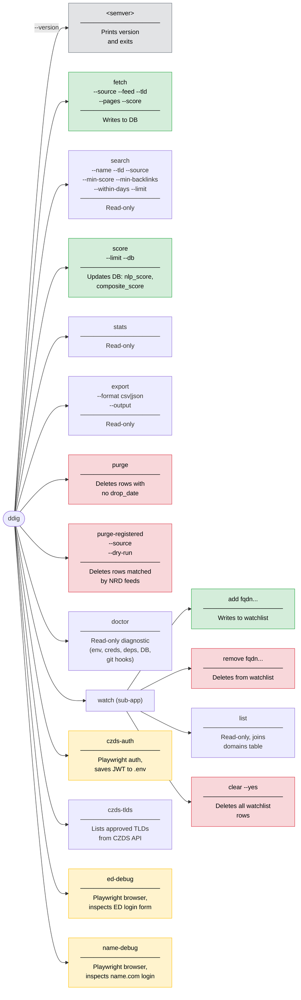

# DDig — CLI Command Map

```mermaid
flowchart LR
    CLI([ddig])

    CLI -- "--version" --> version_out["&lt;semver&gt;\n──────────────────\nPrints version\nand exits"]
    CLI --> fetch["fetch\n--source --feed --tld\n--pages --score\n──────────────────\nWrites to DB"]
    CLI --> search["search\n--name --tld --source\n--min-score --min-backlinks\n--within-days --limit\n──────────────────\nRead-only"]
    CLI --> score["score\n--limit --db\n──────────────────\nUpdates DB: nlp_score,\ncomposite_score"]
    CLI --> stats["stats\n──────────────────\nRead-only"]
    CLI --> export["export\n--format csv|json\n--output\n──────────────────\nRead-only"]
    CLI --> purge["purge\n──────────────────\nDeletes rows with\nno drop_date"]
    CLI --> purgeregistered["purge-registered\n--source\n--dry-run\n──────────────────\nDeletes rows matched\nby NRD feeds"]
    CLI --> doctor["doctor\n──────────────────\nRead-only diagnostic\n(env, creds, deps, DB,\ngit hooks)"]

    CLI --> watch["watch (sub-app)"]
    watch --> wadd["add fqdn...\n──────────────────\nWrites to watchlist"]
    watch --> wremove["remove fqdn...\n──────────────────\nDeletes from watchlist"]
    watch --> wlist["list\n──────────────────\nRead-only, joins\ndomains table"]
    watch --> wclear["clear --yes\n──────────────────\nDeletes all watchlist\nrows"]

    CLI --> czdsauth["czds-auth\n──────────────────\nPlaywright auth,\nsaves JWT to .env"]
    CLI --> czdstlds["czds-tlds\n──────────────────\nLists approved TLDs\nfrom CZDS API"]
    CLI --> eddebug["ed-debug\n──────────────────\nPlaywright browser,\ninspects ED login form"]
    CLI --> namedebug["name-debug\n──────────────────\nPlaywright browser,\ninspects name.com login"]

    style version_out fill:#e2e3e5,stroke:#6c757d,color:#000000
    style fetch    fill:#d4edda,stroke:#28a745,color:#000000
    style score    fill:#d4edda,stroke:#28a745,color:#000000
    style purge    fill:#f8d7da,stroke:#dc3545,color:#000000
    style purgeregistered fill:#f8d7da,stroke:#dc3545,color:#000000
    style wadd     fill:#d4edda,stroke:#28a745,color:#000000
    style wremove  fill:#f8d7da,stroke:#dc3545,color:#000000
    style wclear   fill:#f8d7da,stroke:#dc3545,color:#000000
    style czdsauth fill:#fff3cd,stroke:#ffc107,color:#000000
    style eddebug  fill:#fff3cd,stroke:#ffc107,color:#000000
    style namedebug fill:#fff3cd,stroke:#ffc107,color:#000000
```

**Legend:** 🟢 Green = writes domain data &nbsp; 🔴 Red = destructive &nbsp; 🟡 Yellow = diagnostic / auth &nbsp; ⚫ Grey = read-only flag