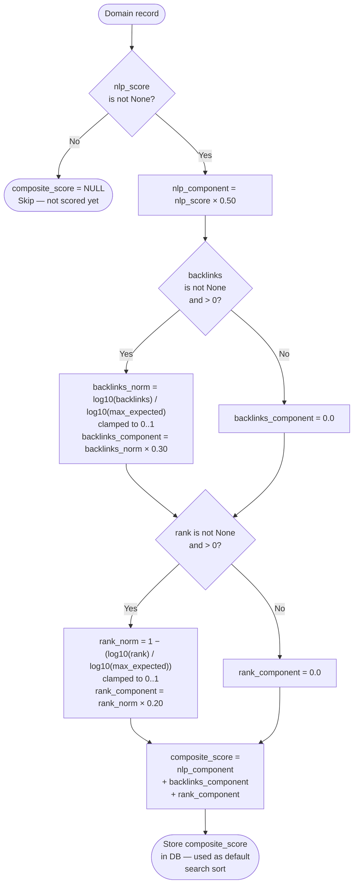

# DDig — Composite Score Formula

### Weights summary

| Component | Weight | Source field | Normalisation |
|-----------|--------|--------------|---------------|
| NLP quality | **50%** | `nlp_score` | Already 0–1 |
| Backlinks | **30%** | `backlinks` | `log10(n) / log10(max)`, clamped 0–1 |
| Rank | **20%** | `rank` | `1 − log10(rank)/log10(max)`, clamped 0–1 (lower rank = better) |

> `composite_score` is the **default sort** for `ddig search`.
> Use `--sort score` to sort by `nlp_score` alone.
> NLP fields are **never overwritten** once set — `composite_score` is recomputed on every upsert where `nlp_score` is already present.