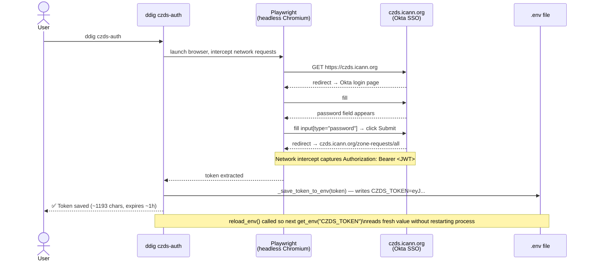
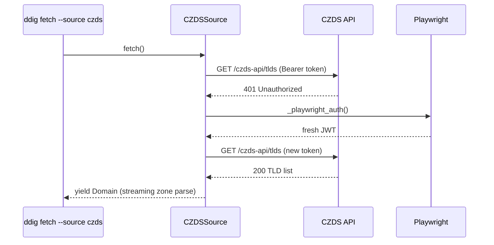

# DDig — CZDS Authentication Flow

```mermaid
sequenceDiagram
    actor User
    participant CLI as ddig czds-auth
    participant PW as Playwright<br/>(headless Chromium)
    participant ICANN as czds.icann.org<br/>(Okta SSO)
    participant ENV as .env file

    User->>CLI: ddig czds-auth
    CLI->>PW: launch browser, intercept network requests

    PW->>ICANN: GET https://czds.icann.org
    ICANN-->>PW: redirect → Okta login page

    PW->>ICANN: fill #emailAddress → click Next
    ICANN-->>PW: password field appears

    PW->>ICANN: fill input[type="password"] → click Submit
    ICANN-->>PW: redirect → czds.icann.org/zone-requests/all

    Note over PW,ICANN: Network intercept captures Authorization: Bearer <JWT>

    PW-->>CLI: token extracted
    CLI->>ENV: _save_token_to_env(token) — writes CZDS_TOKEN=eyJ...
    CLI-->>User: ✅ Token saved (~1193 chars, expires ~1h)

    Note over CLI,ENV: reload_env() called so next get_env("CZDS_TOKEN")\nreads fresh value without restarting process
```

### Auto-refresh path during fetch

```mermaid
sequenceDiagram
    participant CLI as ddig fetch --source czds
    participant CZDS as CZDSSource
    participant API as CZDS API
    participant PW as Playwright

    CLI->>CZDS: fetch()
    CZDS->>API: GET /czds-api/tlds (Bearer token)
    API-->>CZDS: 401 Unauthorized

    CZDS->>PW: _playwright_auth()
    PW-->>CZDS: fresh JWT
    CZDS->>API: GET /czds-api/tlds (new token)
    API-->>CZDS: 200 TLD list
    CZDS-->>CLI: yield Domain (streaming zone parse)
```