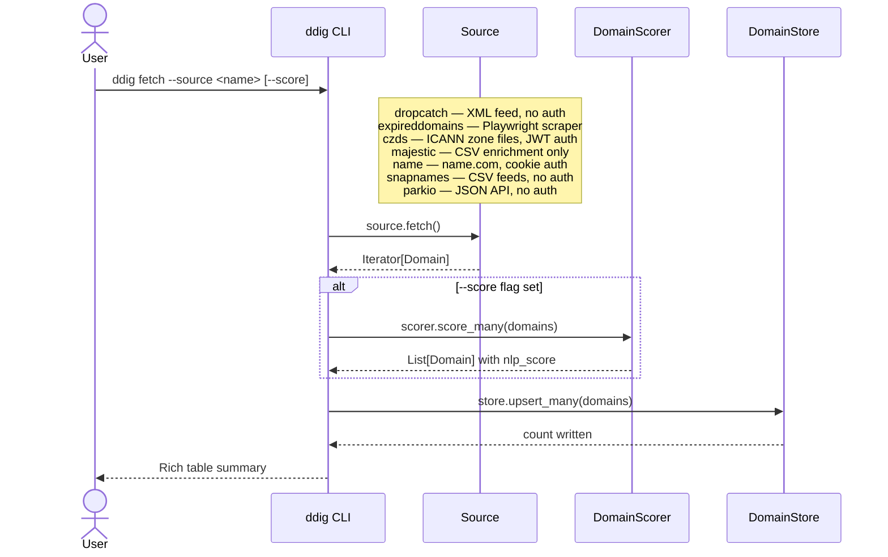
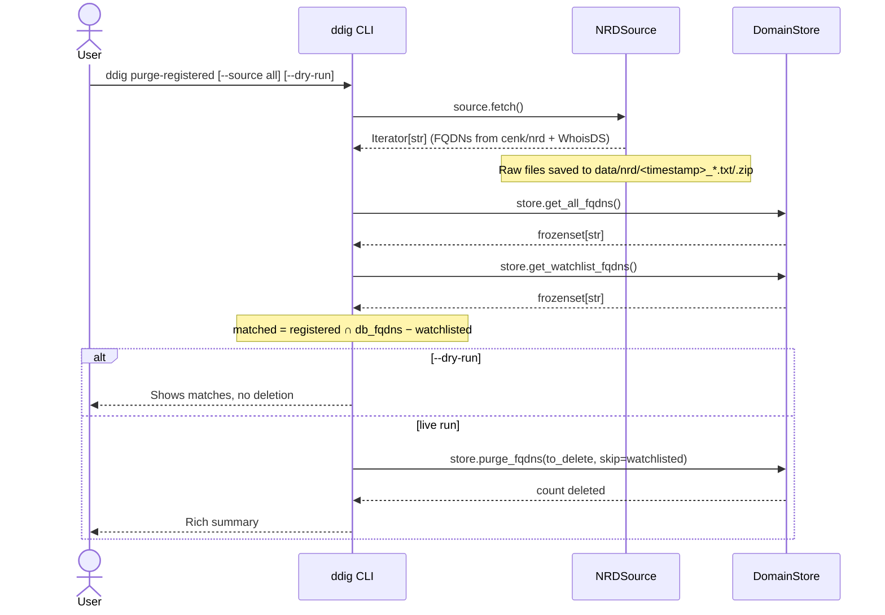

# DDig — Core Data Flow



### Purge-registered path (NRD)



### Enrichment-only path (Majestic)

```mermaid
sequenceDiagram
    actor User
    participant CLI as ddig CLI
    participant MAJ as MajesticMillionSource
    participant DB  as DomainStore

    User->>CLI: ddig fetch --source majestic
    CLI->>DB: store.get_all_fqdns()
    DB-->>CLI: set[str]
    CLI->>MAJ: source.fetch()
    MAJ-->>CLI: Iterator[Domain] (filtered to existing fqdns only)
    CLI->>DB: store.upsert_many(domains)
    DB-->>CLI: count enriched
    CLI-->>User: Rich table summary