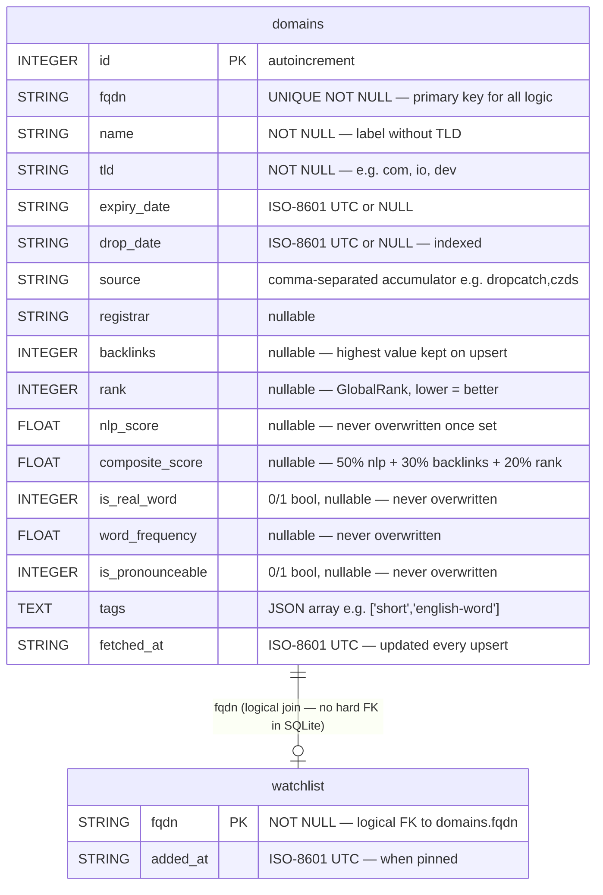

# DDig — Database Entity-Relationship Diagram

### Indexes

| Index name       | Column(s)    | Purpose                        |
|------------------|--------------|--------------------------------|
| `idx_tld`        | `tld`        | Filter by TLD                  |
| `idx_name`       | `name`       | Name search / partial match    |
| `idx_expiry`     | `expiry_date`| Future: expiry-based queries   |
| `idx_drop`       | `drop_date`  | `within_days` filter           |
| `idx_nlp_score`  | `nlp_score`  | `min_score` filter             |
| `idx_source`     | `source`     | Source filter                  |
| `idx_backlinks`  | `backlinks`  | `min_backlinks` filter         |
| `idx_rank`       | `rank`       | `min_rank` / `max_rank` filter |

### Notes
- `domains.fqdn` is the **only** deduplication key — never use `id` for business logic.
- `watchlist.fqdn` has no SQLite `FOREIGN KEY` constraint, but is always joined to `domains` in `watch_list()`.
- `source` is **not** normalised — it is a comma-separated string intentionally, for simplicity and append performance.