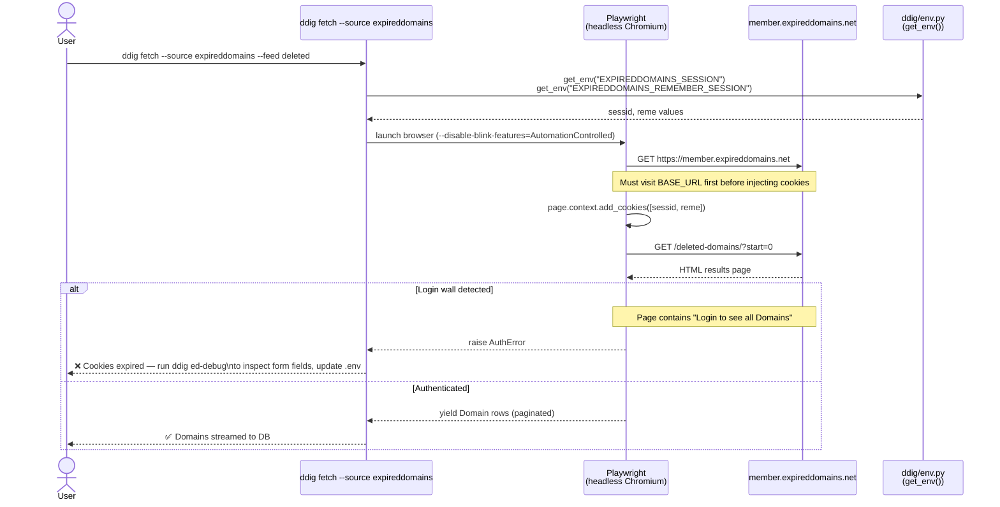
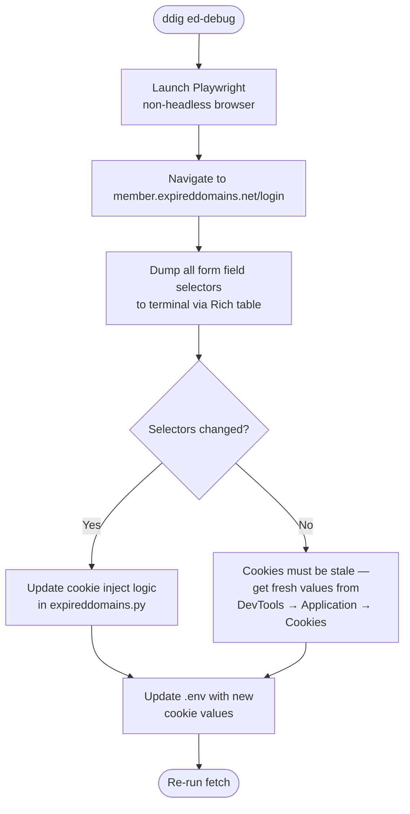

# DDig — ExpiredDomains Authentication Flow

```mermaid
sequenceDiagram
    actor User
    participant CLI as ddig fetch --source expireddomains
    participant PW as Playwright<br/>(headless Chromium)
    participant ED as member.expireddomains.net
    participant ENV as ddig/env.py<br/>(get_env())

    User->>CLI: ddig fetch --source expireddomains --feed deleted
    CLI->>ENV: get_env("EXPIREDDOMAINS_SESSION")<br/>get_env("EXPIREDDOMAINS_REMEMBER_SESSION")
    ENV-->>CLI: sessid, reme values

    CLI->>PW: launch browser (--disable-blink-features=AutomationControlled)
    PW->>ED: GET https://member.expireddomains.net
    Note over PW,ED: Must visit BASE_URL first before injecting cookies

    PW->>PW: page.context.add_cookies([sessid, reme])
    PW->>ED: GET /deleted-domains/?start=0
    ED-->>PW: HTML results page

    alt Login wall detected
        Note over PW,ED: Page contains "Login to see all Domains"
        PW-->>CLI: raise AuthError
        CLI-->>User: ❌ Cookies expired — run ddig ed-debug\nto inspect form fields, update .env
    else Authenticated
        PW-->>CLI: yield Domain rows (paginated)
        CLI-->>User: ✅ Domains streamed to DB
    end
```

### ed-debug diagnostic flow

```mermaid
flowchart TD
    A([ddig ed-debug]) --> B[Launch Playwright\nnon-headless browser]
    B --> C[Navigate to member.expireddomains.net/login]
    C --> D[Dump all form field selectors\nto terminal via Rich table]
    D --> E{Selectors changed?}
    E -- Yes --> F[Update cookie inject logic\nin expireddomains.py]
    E -- No --> G[Cookies must be stale —\nget fresh values from\nDevTools → Application → Cookies]
    F --> H[Update .env with new\ncookie values]
    G --> H
    H --> I([Re-run fetch])
```