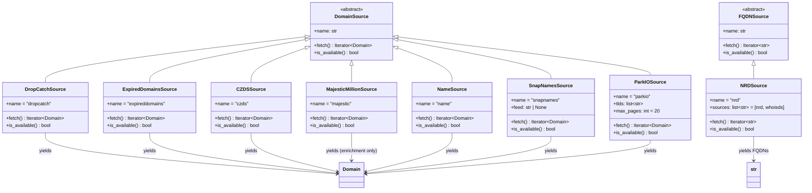

# DDig — Source & Store Class Hierarchy

```mermaid
classDiagram
    class DomainSource {
        <<abstract>>
        +name: str
        +fetch() Iterator~Domain~
        +is_available() bool
    }

    class DropCatchSource {
        +name = "dropcatch"
        +fetch() Iterator~Domain~
        +is_available() bool
    }

    class ExpiredDomainsSource {
        +name = "expireddomains"
        +fetch() Iterator~Domain~
        +is_available() bool
    }

    class CZDSSource {
        +name = "czds"
        +fetch() Iterator~Domain~
        +is_available() bool
    }

    class MajesticMillionSource {
        +name = "majestic"
        +fetch() Iterator~Domain~
        +is_available() bool
    }

    class NameSource {
        +name = "name"
        +fetch() Iterator~Domain~
        +is_available() bool
    }

    class SnapNamesSource {
        +name = "snapnames"
        +feed: str | None
        +fetch() Iterator~Domain~
        +is_available() bool
    }

    class ParkIOSource {
        +name = "parkio"
        +tlds: list~str~
        +max_pages: int = 20
        +fetch() Iterator~Domain~
        +is_available() bool
    }

    class FQDNSource {
        <<abstract>>
        +name: str
        +fetch() Iterator~str~
        +is_available() bool
    }

    class NRDSource {
        +name = "nrd"
        +sources: list~str~ = [nrd, whoisds]
        +fetch() Iterator~str~
        +is_available() bool
    }

    DomainSource <|-- DropCatchSource
    DomainSource <|-- ExpiredDomainsSource
    DomainSource <|-- CZDSSource
    DomainSource <|-- MajesticMillionSource
    DomainSource <|-- NameSource
    DomainSource <|-- SnapNamesSource
    DomainSource <|-- ParkIOSource
    FQDNSource <|-- NRDSource
    NRDSource --> str : yields FQDNs

    DropCatchSource --> Domain : yields
    ExpiredDomainsSource --> Domain : yields
    CZDSSource --> Domain : yields
    MajesticMillionSource --> Domain : yields (enrichment only)
    NameSource --> Domain : yields
    SnapNamesSource --> Domain : yields
    ParkIOSource --> Domain : yields
```