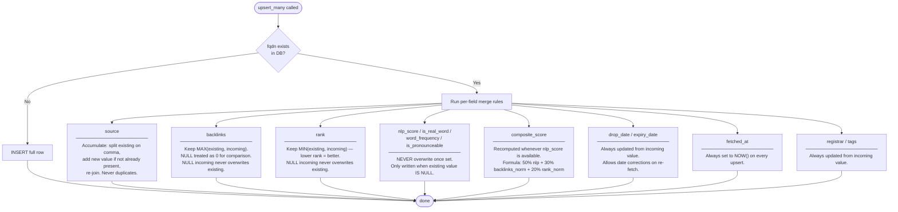

# DDig — Upsert Conflict Resolution Logic

Describes per-field merge rules applied in `DomainStore.upsert_many()` when a domain with the same `fqdn` already exists.

```mermaid
flowchart TD
    A([upsert_many called]) --> B{fqdn exists\nin DB?}

    B -- No --> C[INSERT full row]
    C --> Z([done])

    B -- Yes --> D[Run per-field merge rules]

    D --> SRC["source\n──────────────────────\nAccumulate: split existing on comma,\nadd new value if not already present,\nre-join. Never duplicates."]
    D --> BL["backlinks\n──────────────────────\nKeep MAX(existing, incoming).\nNULL treated as 0 for comparison.\nNULL incoming never overwrites existing."]
    D --> RNK["rank\n──────────────────────\nKeep MIN(existing, incoming) — lower rank = better.\nNULL incoming never overwrites existing."]
    D --> NLP["nlp_score / is_real_word /\nword_frequency / is_pronounceable\n──────────────────────\nNEVER overwrite once set.\nOnly written when existing value IS NULL."]
    D --> CS["composite_score\n──────────────────────\nRecomputed whenever nlp_score is available.\nFormula: 50% nlp + 30% backlinks_norm + 20% rank_norm"]
    D --> DD["drop_date / expiry_date\n──────────────────────\nAlways updated from incoming value.\nAllows date corrections on re-fetch."]
    D --> FT["fetched_at\n──────────────────────\nAlways set to NOW() on every upsert."]
    D --> REG["registrar / tags\n──────────────────────\nAlways updated from incoming value."]

    SRC & BL & RNK & NLP & CS & DD & FT & REG --> Z
```